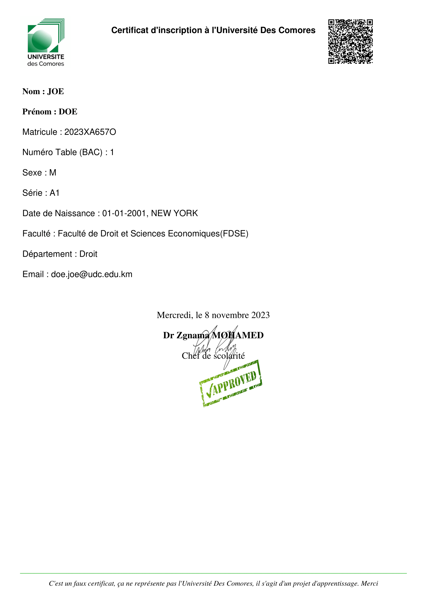

# Gestion des Préinscriptions Enseignement Sup

#### Video Demo:  <https://youtu.be/Mujvuv3jG98?si=UOrMaI3hyvQO4sRY>

#### Description:
Ce programme a pour objectif de simuler le processus d’inscription des étudiants à l’Université des Comores (UDC), dans un cadre pédagogique à la suite du cours [HRVARDx CS50’s Introduction to Programming with Python](https://cs50.harvard.edu/python/2022/). Il s’agit d’une solution simplifiée qui ne prétend pas refléter la réalité d’un système d’inscription universitaire. Ce programme vise à illustrer les notions fondamentales de la programmation Python et de la manipulation des données CSV. Il ne tient pas compte de toutes les contraintes et spécifications d’un véritable système d’inscription universitaire. Le programme se divise en deux parties, une pour les étudiants et une pour l’administration, qui offrent des fonctionnalités adaptées à chaque type d’utilisateur.

## Certificat

## Table des matières

- [Auteur](#auteur)
- [Fonctionnalités](#fonctionnalités) 
- [Exigences](#exigences) ``requirements.txt``
- [Utilisation](#utilisation)
- [Structure du Programme](#structure-du-programme)
- [Classes](#classes)
- [Fonctions](#fonctions)
- [Licence](#licence)

## Auteur
- Développé par : 
# [Ambdil-Kayoum MOHAMED](https://linktr.ee/Kayoummh)

## Fonctionnalités
Le programme comprend les fonctionnalités suivantes :

#### Capture :

Image 1: execution du programme 
        
### Fonctionnalités pour les Étudiants
1. ***Inscription des Étudiants:*** 
Les étudiants peuvent s'inscrire en fournissant leur numéro de baccalauréat (BAC).
Le système recueille des informations telles que le nom, le prénom, le sexe, et la série du baccalauréat, la date de naissance et le lieu.
Le choix des filières d'études est proposé en fonction de la série du baccalauréat.
Le système génère automatiquement un matricule et une adresse e-mail institutionnelle pour chaque étudiant.
Un fichier PDF contenant toutes les informations de l'étudiant est généré à la fin du processus d'inscription.
Les étudiants ont la possibilité de modifier certaines informations, à l'exception du numéro de BAC, du matricule, et de la série.

#### Capture:

Image 2: Inscription d'un etudiant

#### Géneration de fichier d'incription PDF de l'etudiant

#### Capture:

Image 3: Fichier pdf qui se gènere pour chaque Etudiant inscrit avec un QrCode qui contient certains données de l'Etudiant

###

2. ***Affichage et Modification des Informations:***
Les étudiants peuvent afficher leurs informations personnelles en se connectant à l'aide de leur adresse e-mail institutionnelle et de leur matricule.
Ils ont la possibilité de modifier certaines de leurs informations si nécessaire.

#### Capture:

Image 4: Connection de l'etudiant

### Fonctionnalités pour l'Administration
***Les administrateurs ont accès à des fonctionnalités de gestion avancées, notamment :***
Tri des étudiants inscrits.
Affichage du nombre total d'étudiants inscrits.
Ce programme facilite la gestion des inscriptions des étudiants à l'Université des Comores en fournissant une interface conviviale pour les étudiants et des outils efficaces pour l'administration. Il simplifie le processus d'inscription, de suivi et de gestion des informations des étudiants.

#### Capture:

Image 5: Interface Administration

## Exigences

Pour exécuter ce programme, vous aurez besoin de Python 3.8 ou plus ainsi que des bibliothèques externes suivantes :
faites un  - ``pip install -r requirements.txt`` pour installer les dépendances:

- `re` : Expressions régulières (intégré).
- `time` : Fonctions liées au temps (intégré).
- `csv` : Gestion des fichiers CSV (intégré).
- `datetime` : Manipulation des dates et heures (intégré).

## Utilisation

1. Faites un git clone : ``git clone https://github.com/Kymhd/CS50p-projet-Gestion-des-preinscriptions-dans-un-etablissemnt-superieur/tree/main``
2. Assurez-vous d'avoir Python et les bibliothèques requises installées ``pip install -r requirements.txt``.
3. Exécutez le programme en lançant le script `projet.py`.

## Structure du Programme

Le programme se compose des modules et classes suivants :

- `projet.py` : Le script principal pour exécuter le programme.
- `etudiant.py` : Contient la classe `Student` pour gérer les dossiers des étudiants.
- `validation.py` : Fournit des fonctions de validation d'adresse e-mail.
- `universite.py` : Gère les données liées à l'université (séries, facultés, départements).
- `genererPDF.py` : Génère des certificats PDF pour les étudiants.
- `admin.py` : Fournit des fonctions administratives.

## Classes

### `Etudiant` (dans `etudiant.py`)

Représente un étudiant inscrit à l'université. Elle hérite de la classe `Student`.

Attributs :
- `numero` (int) : Le numéro d'ordre de l'étudiant.
- `matricule` (str) : Le numéro d'inscription de l'étudiant.
- `nom` (str) : Le nom de famille de l'étudiant.
- `prenom` (str) : Le prénom de l'étudiant.
- `sexe` (str) : Le genre de l'étudiant ('M' ou 'F').
- `serie` (str) : La série du baccalauréat de l'étudiant.
- `date_naissance` (str) : La date et le lieu de naissance de l'étudiant.
- `faculte` (str) : La faculté à laquelle l'étudiant appartient.
- `departement` (str) : Le département auquel l'étudiant appartient.
- `email` (str) : L'adresse e-mail de l'étudiant.

Méthodes :
- `modifier_informations()` : Permet de modifier les informations de l'étudiant.
- `modifier_nom_prenom()` : Permet de modifier le nom et le prénom de l'étudiant.
- `valider_nom_prenom(nom, prenom)` : Valide le nom et le prénom.
- `construire_email(nom, prenom)` : Construit l'adresse e-mail de l'étudiant.
- `modifier_sexe()` : Permet de modifier le sexe de l'étudiant.
- `modifier_date_lieu()` : Permet de modifier la date et le lieu de naissance de l'étudiant.
- `modifier_universite()` : Permet de modifier les choix liés à l'université de l'étudiant.
- `enregistrer_dans_csv()` : Enregistre les informations de l'étudiant dans un fichier CSV.
- `__str__()` : Renvoie une représentation sous forme de chaîne de caractères de l'objet étudiant.

### Autres Classes (universite.py, validation.py, admin.py)

Ces classes gèrent des fonctionnalités spécifiques liées aux universités, à la validation et aux opérations administratives.

## Fonctions

- `saisir_numero()` : Demande à l'utilisateur de saisir son numéro d'étudiant et le valide.
- `charger_etudiants()` : Charge la liste des étudiants à partir du fichier CSV.
- `tri_etudiants()` : Trie et affiche les étudiants en fonction de leur faculté.
- `afficher_informations_etudiant(etudiant)` : Affiche les informations de l'étudiant sous forme de tableau.
- `numero_existe_deja(numero)` : Vérifie si un étudiant avec le même numéro existe déjà.
- `enregistrer_etudiant(numero)` : Enregistre un nouvel étudiant et sauvegarde ses informations dans le fichier CSV.
- `connecter_etudiant(num_etudiant)` : Connecte un étudiant existant et affiche ses informations.
- `enregistrer_donne(donne)` : Enregistre la liste des étudiants dans le fichier CSV.

Des test ``pytest`` pour la classe ``Student`` et des test pour les fonctions pricipales dans le fichier ``projet.py``.

## Licence

Ce programme est fourni sous la licence [MIT](LICENSE) pour plus de détails.

MERCI
